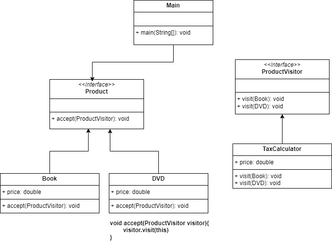

# Visitor Pattern

The Visitor Pattern is a behavioral design pattern that lets you add new operations to existing object structures 
without modifying the classes of the elements you operate on.

Let’s say we have Book and DVD, and we want to apply different taxes. Instead of putting tax logic in each product, 
we define a Visitor.
   For code, refer com.designPatterns.behavior.visitor

## When to use Visitor pattern

- Implement the visitor design pattern in Java when you need to efficiently perform operations across
groups of similar objects without modifying their classes, and you want to avoid polluting their classes
with this operation.