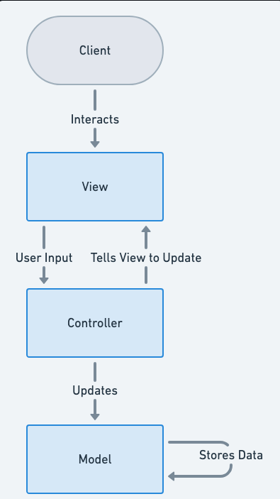

# MVC (Model View Controller)

MVC separates the business logic from user interface by mediating **Controller** between Model and View.

## Real world use

In my IVR projects, I used to see that a decision used to invoke a class.
Instead, of using controller, every logic was stuffed in that single class, making the class very tough to maintain.
Each new feature, you had to read every single word of the class. And even then the class was fragile. 
High level policy and low level details were all mixed together.
One exception, and whole IVR stopped for the user, that exit returned by class did not match exits in decision file

I refactored my IVR class as below

com.yourapp.fastag
├── controller
├── service
├── domain
├── dto
├── mapper
├── exception
├── repository
├── config
├── util
└── integration

### controller

This package contained the class being invoked by decision. This is a high level class, containing routes
and interacts with appropriate sevice methods.
For spring project, handles HTTP requests.

### service

One layer below controller layer. Contains business logic.

### domain

Contains Domain model/entities. Represents the DB schema or key business concepts.
For ex, I used Enums for my exit routes. 

### DTO (Data Transfer Objects)

In our project, we used package called hostResponseBeans
Define structured data for requests (UserRequest, PaymentRequest) and responses (UserResponse).
Reduce over-fetching by tailoring fields. (this we did not do, but I did for Fastag) 
Decouple API from internal model.

### mapper

Convert between domain and dto objects. (need to create this package in my fastag)

#### exception

For centralized exception handling. (not used in fastag, but will use for my other projects)

### repository

Data access layer. (Haven't used till now. We only use APIs to talk to DB)
Define queries for database operations.
Retrieve, persist, update, delete domain entities.

### config

Set up beans (e.g., ModelMapper, ObjectMapper, CORS, Swagger, security).
External service configuration (e.g., Kafka, Redis, etc.).
Define constants or environment-specific settings.
(not used till now)

### util

General helper methods. Static utility classes and helpers.
Foe ex, Token generation, encryption, logging utilities.
Avoid placing business logic here.

### integration

External system communication (third-party APIs, services).

Interact with payment gateways, third-party services (e.g., vehicle DB, recharge APIs).
(my fastag doesen't do all this stuff. Only talk to agent via ICM and send SMS)