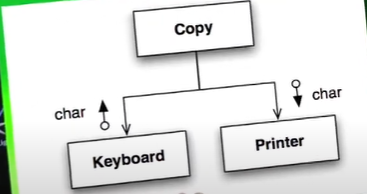

# Boundaries

## Make clean boundaries or layers

A clean boundary should be supported by a set of outbound tests that exercise the interface the same way the
production code does. 
	Without these boundary tests to ease the migration, we might be tempted to stay with the old version longer 
	than we should.

Boundary = the last layer where you can change the external dependency without impacting the rest of your codebase.

For ex: out service class was a boundary. 
SnakeYAML -> ServiceClass -> Rest of client code

We could had ommitted Service class, but then SakeYAML would perforate into rest of client code.
And now when snake YAML changed, your code has to change. 

```java
 // a simple learning test for logging
@Test
    public void isLogGenerating(){
        LogUtil.logInfo("Tests executed");
    }
}

```

## Adapter Pattern

The Adapter Pattern is like a translator between incompatible interfaces, allowing two otherwise incompatible classes to work together 
seamlessly — all without modifying their existing code.

How it works

- Client code calls methods on the target interface.
- The adapter implements the target interface.
- Inside the adapter, it converts (adapts) the calls to the methods of the adaptee, which actually does the work.
- The adapter returns results (if any) back to the client in the expected format.

## Inversion of Control


```C

//the client has no option to change, it will have to read from keyboard and write to printer
//Adding new devices will cause copy to fan out

void copy(){
	int c;
	while((c = readKeyboard) != EOF){
		writePrinter(c);
	}
}

// Inversion of control : Read from STDIN and write to STDOUT
// STDIN can be anything a keyboard, internet device etc
// STDOUT could be anything a printer, screen etc

void copy(){
	int c;
	while((c = getchar()) != EOF){
		putchar(c);
	}
}
```

```java
//OO version

public interface Reader{
	char getchar();
}

public interface Writer{
	char putchar();
}

void copy(Reader reader, Writer writer){
	int c;
	while((c = reader.getchar()) != EOF){
		writer.putchar(c);
	}
}

public Keyboard implements Reader{...}
public Printer implements Writer{...}

```


