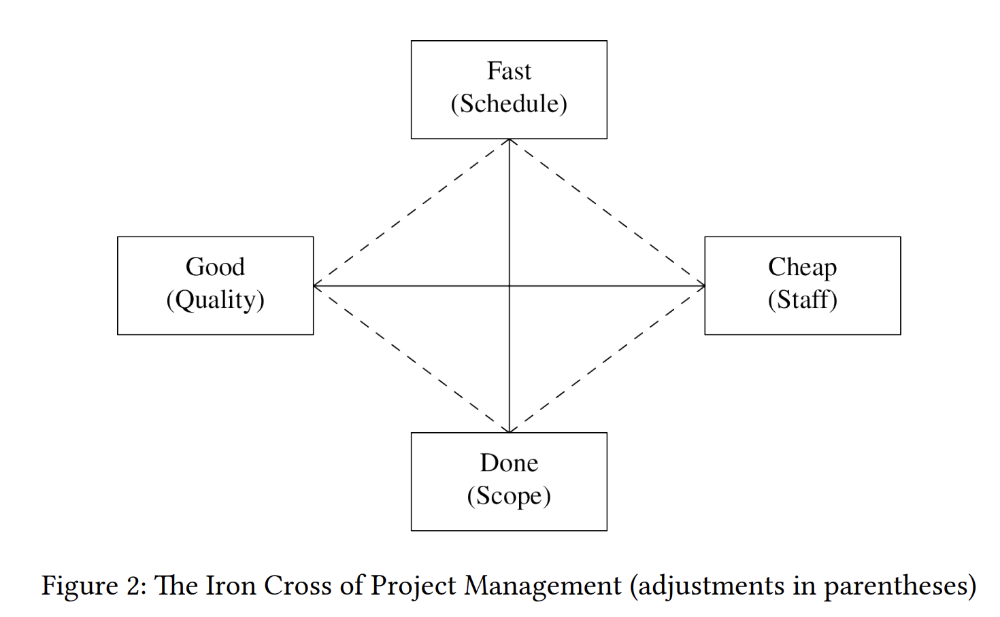
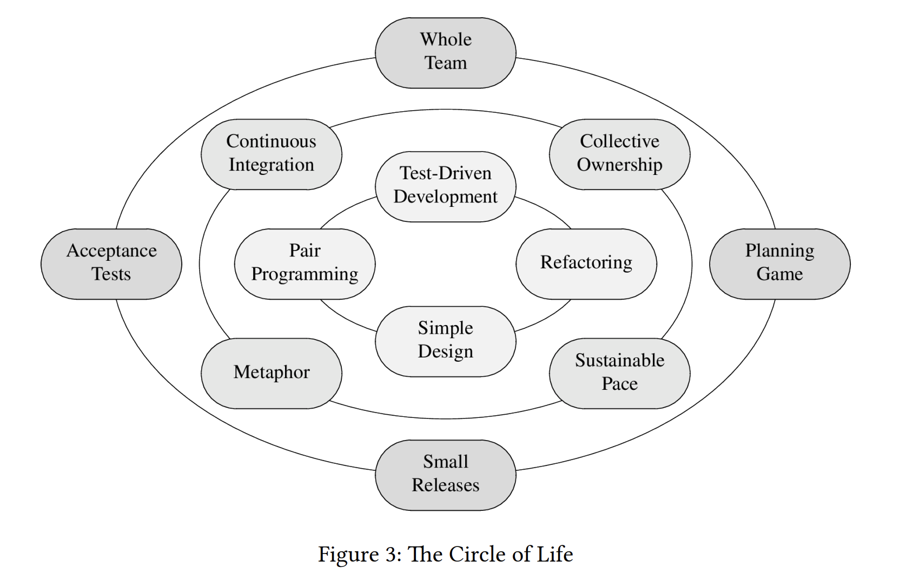

# Agile

All projects are constrained by a trade-off called the Iron Cross of Project Management: 
good, fast, cheap, done—pick three! 
    Good project managers understand this trade-off and strive for
results that are done good enough within an acceptable time frame and budget, which provide
the crucial features.

- Break a project into fixed size chunks or iteration.
- Measure how much time you take to complete an iteration.
- Study those numbers and adjust accordingly.

Each iteration produces data, not code.
Agile may improve speed of project, but it actually tells us what is the speed of the project.

## Agile Manifesto

We are uncovering better ways of developing software by doing it and helping
others do it.

- Individuals and interactions over processes and tools
- Working software over comprehensive documentation
- Customer collaboration over contract negotiation
- Responding to change over following a plan

That is, while there is value in the items on the right, we value the items on the
left more

## Circle of life

- Agile = Philosophy
- XP    = Implementation

### Outer Ring

The outer ring contains the business-facing practices, which are quite similar to the Scrum
process:

- Planning Game: breaking down a project into features, stories, and tasks
- Small Releases: delivering small, but regular increments
- Acceptance Tests: providing unambiguous completion criteria (definition of “done”)
- Whole Team: working together in different functions (programmers, testers, management)

### Middle ring

The middle ring contains the team-facing practices:

- Sustainable Pace: making progress while preventing burnout of the developing team
- Collective Ownership: sharing knowledge on the project to prevent silos
- Continuous Integration: closing the feedback loop frequently and keeping the team’s focus
- Metaphor: working with a common vocabulary and language

### Innermost ring

The inner ring contains technical practices:

- Pair Programming/Pairing: sharing knowledge, reviewing, collaborating
- Simple Design: preventing wasted efforts
- Refactoring: refining and improving all work products continuously
- Test-Driven Development: maintaining quality when going quickly

## Reasons for Agile

Important reasons for adopting Agile are professionalism and reasonable customer expectations.

### Professionalism

In Agile, high commitment to discipline is more important than ceremony. Disciplined, professional behaviour 
becomes more important as software itself becomes more important.

### Reasonable customer expectation

Managers, customers, and users have reasonable expectations of software and its programmers.
The goal of Agile development is to meet those expectations, which is not an easy task:

- Do not ship bad software: A system should not require from a user to think like a programmer. 
    People spend good money on software—and should get high quality with fewdefects in return.

- Continuous technical readiness: Programmers often fail to ship useful software in time,
    because they work on too many features at the same time, instead of working only on
    the most important features first. Agile demands that a system must be technically deployable 
    at the end of every iteration. The code is clean, and the  tests all pass. Deploying
    or not—this is no longer a technical but a business decision.

- Stable Productivity: Progress usually is fast at the beginning of a project, but slows
    down as messy code accumulates. Adding people to a project only helps in the long
    run—but not at all if those new programmers are trained by those programmers that
    created the mess in the first place. As this downward spiral continues, progress comes
    to a halt. 

- Inexpensive Adoptability: Software (“soft”), as opposed to hardware (“hard”) is supposed to be easy to change. 
    Often seen as a nuisance by some developers, changing requirements are the reason why the discipline of software 
    engineering exists. (If nothing ever changed, hardware could be developed instead.) A good software system is easy
    to change.

- Continuous Improvement: Software should become better as time goes. Design, architecture, code structure, efficiency, 
    and throughput of a system should improve and not detoriate over time.

- Fearless Competence: Developers are often afraid of modifying bad code, and therefore, bad code isn’t improved.
    (“You touch it, you break it. You break it, you own it.”)
    Test-Driven Development is helpful to overcome this fear by allowing for an automated quality assessment after 
    every change to the code.

- No QA Findings: Bugs should not be discovered by QA, but avoided or eliminated by the development team in the first 
    place. If the QA finds bugs, the developers must not only fix those, but also improve their process.

- Test Automation: Manual tests are expensive and, thus, will be reduced or skipped if
    the project’s budget is cut. If development is late, QA has too little time to test. Parts
    of the system remain untested. Machines are better at performing repetetive tasks like
    testing than humans (except for exploratory testing). It is a waste of time and money to
    let humans perform manual tests; it’s also immoral.

- Cover for each other: Developers must help each other; they must act as a team. If
    somebody fails or gets sick, the other team members must help out. Every developer
    must ensure that others can cover for him or her by documenting the code, sharing
    knowledge, and helping others reciprocally.

- Honest Estimates: Developers must be honest with their estimates based on their level
    of knowledge. Under uncertainty, ranges (“5 to 15 days”) rather than exact estimates
    (“10 days”) should be provided. Tasks can’t always be estimated exactly, but in relation
    to other tasks (“this takes twice as long as that”).

- Saying “No”: If no feasible solution for a problem can be found, the developer must say
    so. This can be inconvenient, but could also save bigger trouble down the road.

- Continuous Learning: Developers must keep up with an ever and fast changing industry
    by learning all the time. It’s great if a company provides training, but the responsibility
    for learning remains with the developer.

- Mentoring: Existing team members must teach new team members. Both sides learn in
    the process, because teaching is a great way of learning.