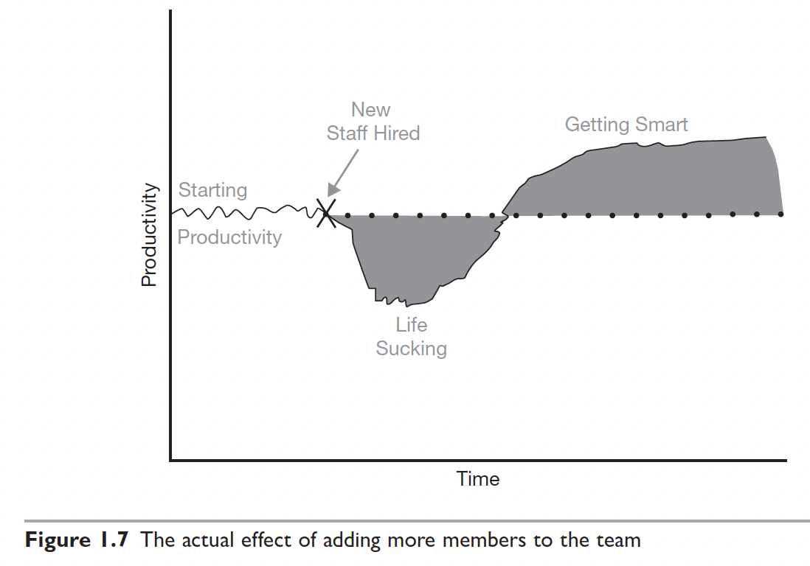

# Extreme Programming (XP) Business practices

A company always has more ideas than it can implement:

* New features
* Bug fixes
* Refactoring
* Infrastructure improvements
* Marketing initiatives
* Compliance work

The question becomes:

“What should we spend our limited budget and development capacity on next?”

That’s exactly what this matrix answers.

1. Valuable, but cheap: those stories should be done right away.
2. Valuable, but expensive: those stories should be done later on.
3. Not valuable, but expensive: don’t do this stories, discard them.
4. Not valuable, but cheap: consider doing those stories (much) later.

## Application 1 : Sample company

Suppose a product owner has four possible features:

“For the effort required, how much value will this give me?”

The best opportunities are usually in the top-right quadrant: High Value, Low Cost (“Do Now”).

| Feature                     | Value    | Cost     |
| --------------------------- | -------- | -------- |
| Password Reset              | High     | Low      |
| AI recommendation engine    | High     | High     |
| Dark Mode                   | Low      | Low      |
| VR interface                | Low      | High     |

Using the matrix:

* Password reset → Do Now
* AI recommendation engine → Do Later
* Dark mode → Do Much Later
* VR interface → Never Do

## Application 2 : Backend Switch Roadmap

Guiding Principle

The goal is not:

Learn everything before applying.

The goal is:

Learn enough to become employable, get the backend role, and then continue learning for the next 20 years.

The Four Quadrants

### Do Now (High Value, Low Cost)

These activities provide the highest return for the least effort and directly improve interview readiness.

1. Spring Boot Project

2. DBMS Fundamentals and SQL

3. Essential DSA

4. Git and Docker

5. Apply While Learning

Do not wait until everything is complete.

Start applying once you have:

* One solid project
* DBMS fundamentals
* SQL proficiency
* Basic DSA preparation

### Do Later (High Value, High Cost)

These are excellent investments but should not delay the switch.
But do after obtaining a backend role.

1. Build Your Own Database

2. Operating Systems

3. Kubernetes

4. Distributed Systems

5. Physics and Computer Graphics Project

### Do Much Later (Low Value, Low Cost)

Interesting but not immediately useful.

Examples:

* IDE customization
* Advanced Maven internals
* Learning multiple frontend frameworks
* Fancy logging frameworks

### Avoid for Now (Low Value, High Cost)

These activities create the illusion of progress while delaying the switch.

1. Learn Everything Before Applying

Bad path:

DBMS
→ OS
→ CN
→ Distributed Systems
→ Kubernetes
→ Build Database
→ Apply

Result:

Years pass.

No interviews.

2. Perfect Project Syndrome

Bad path:

- Need Microservices
- Need Kafka
- Need Redis
- Need Kubernetes
- Need Monitoring
- Need CI/CD
- Need Service Mesh
- Need Cloud Native Architecture

Result:

Project never finishes.

