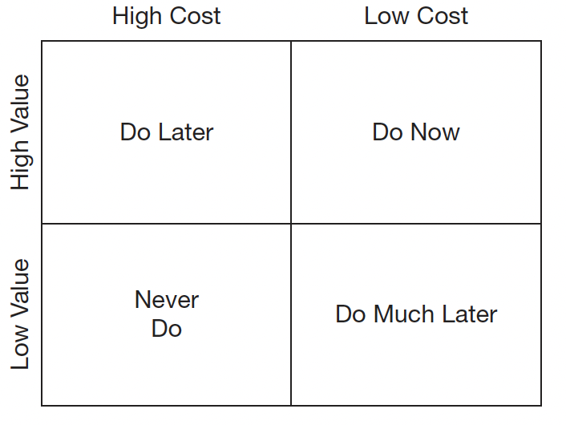

# Business practices

A company always has more ideas than it can implement:

* New features
* Bug fixes
* Refactoring
* Infrastructure improvements
* Marketing initiatives
* Compliance work

The question becomes:

“What should we spend our limited budget and development capacity on next?”

That’s exactly what this matrix answers.

## Application

Suppose a product owner has four possible features:

“For the effort required, how much value will this give me?”

The best opportunities are usually in the top-right quadrant: High Value, Low Cost (“Do Now”).

| Feature                     | Value    | Cost     |
| --------------------------- | -------- | -------- |
| Password Reset              | High     | Low      |
| AI recommendation engine    | High     | High     |
| Dark Mode                   | Low      | Low      |
| VR interface                | Low      | High     |

Using the matrix:

* Password reset → Do Now
* AI recommendation engine → Do Later
* Dark mode → Do Much Later
* VR interface → Never Do